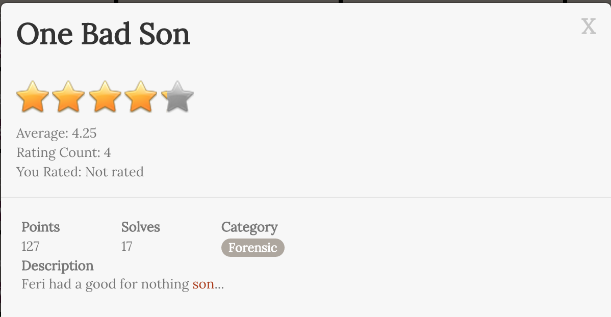

# One Bad Son

## Description



題目給了一個 [FILE](OneBadSon.txz)

透過 `xz -cd OneBadSon.txz | tar x`

得到一個 BSON 格式的檔案 [FILE](OneBadSon/dat.txt)

``` 
BSON Format:
_id: 編號
fname: junk 或 flag
len: dat 裡的 base64 字串 decode 之後的長度
dat: base64 字串
crc: base64 字串的 crc
raw: type 是 int64
mtime: UTC datetime
```

再把 mtime 重新排列過一次，然後再把重複字串去掉 [FILE](OneBadSon/dat_time.txt)


The flag is `ASIS{My_Bad_Son_Lik3_BSON_MongoDB_f!1e_Form4t}`

