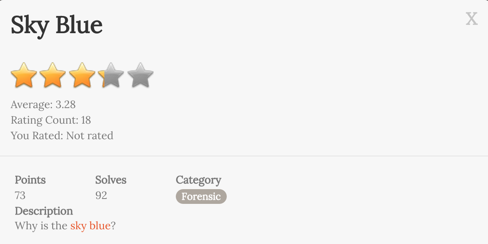
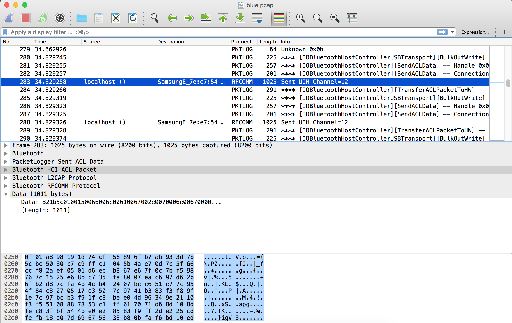

# Sky Blue

## Description

裡面有一個壓縮過的 [File](blue.txz)

解壓縮後 `xz -cd blue.txz | tar x`

獲得一個 WireShark 的 [File](blue/blue.pcap)

打開 WireShark 分析分包，可以看到 284 筆有一筆 Data

使用 [NetworkMiner](http://www.netresec.com/?page=NetworkMiner) 得到圖片

The flag is `ASIS{ee9aa3fa92bff0778ab7df7e90a9b6ba}`
