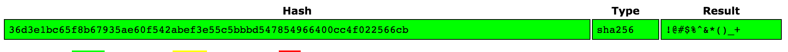
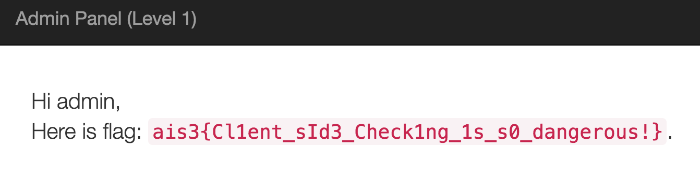

# AIS3 2016 Final Exam

Author: WeiYu < zxc41329 [at] gmail.com >

Date: 2016.08.28

## misc-1

Hint: Throw ball to the Pokemon

打開 [misc1.txt](misc1/misc1.txt)

會發現是一長串加密的文件，根據開頭 `begin 644` 餵 Google 後，

可以知道它是 `uuencode` 加密文件，

解密 `uudecode misc1.txt`，

得到一個沒副檔名的檔案 [misc1/quiz]，

用 `file quiz` 得知是一個 gzip 的壓縮檔案，

解壓縮後 `tar xvf quiz`，得到一個文件 [tmp](misc1/tmp)

裡面有 有一個寶貝球 & 傑尼龜 

根據提示可能需要把這兩張圖片 overlay，

後來找到這個網站 [imgonline](http://www.imgonline.com.ua/eng/impose-picture-on-another-picture.php)

得到 

The flag is `ais3{~Black_n_White_vi5ual_crYPtoGraPhY~}`

## misc-2

## misc+crypto-1

## web-1

連接 `https://final.ais3.org:10280`

看到一個管理員的登入介面，

我們觀看原始碼，看到一個可疑的 db.js，

點進去後

可以拿到 sha256 加密過後的 password，

拿去解密得到就可以得到登入密碼，

我們用這組密碼拿去登入，進去後 Flag 出現拉～

The flag is `ais{Cl1ent_sId3_check1ng_1s_s0_dangerous!}`
 
## web-2

連結 `https://final.ais3.org:10280`

## web-3

連接 `https://final.ais3.org:10380`

這次又是跟 Pre-exam 一樣是個 Snoopy Flag Service，(出題者到底有多愛 Snoopy)

試著尋找是否有 LFI 的漏洞，試了很久卻一無所獲，

最後嘗試用 `php://filter` 看是否能拿到原始碼

`https://final.ais3.org:10380/?p=php://filter/convert.base64-encode/resource=welcome`

皇天不負苦心人，終於拿到 index 的 base64 拉～

Base64 Decode 後，拿到 [index.php](web3/index.php) 原始碼，

之後，試看看用同樣方式看是否能拿到 flag.php 的原始碼，

`https://final.ais3.org:10380/?p=php://filter/convert.base64-encode/resource=flag`

果不其然，這題沒那麼簡單被 waf 濾掉了，又看到了該死的甘道夫，

我們再利用 [index.php](web3/index.php) 原始碼獲得了一些線索，

查詢到這個 [SQL Injection Bypassing WAF](https://www.owasp.org/index.php/SQL_Injection_Bypassing_WAF)

果然，url encode 可以逃離 waf 的限制，因此，

`https://final.ais3.org:10380/?p=php://filter/convert.base64-encode/resource=fl%61g`

哈哈，拿到原始碼拉～

打開來看， Flag 果然躺在這裡 Q_Q

The flag is `ais3{Sn00py_1s_so_cuT3!!!but_there_1s_a_Fxcking_WAF!}`

## 心得

去年參加 AIS3 2015 就對資安產生興趣，

針對 CTF 解題的思路覺得很有趣，

更喜歡解出來後豁然開朗的感覺，

因此今年又再度參加一次，

今年的課程比去年好消化很多，

講師也非常用心把自己專業知識傳授給我們，

印象最深的是 Asuka Nakajima 的投影片「逆向工程道館」看得出相當用心，

讓原本對組語不熟的我，也可以有點 Sense， XD

當然我更會利用工具來做檔案或者 web 分析像是： [angr](https://github.com/angr)、[Burp Suite](https://portswigger.net/burp/)...etc.

這個禮拜收穫很多也結識了很多大大，

希望自己一年比一年更進步，

期許明年有能力解 Binary、Pwn 之類的題目，Cheer Up!!!

2016「金盾獎」見拉！！ 
