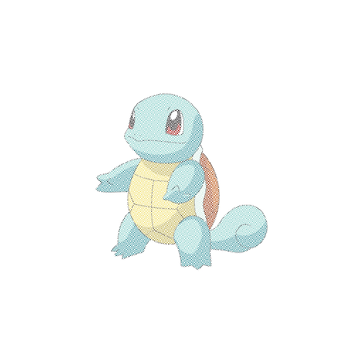

# AIS3 2016 Final Exam

Author: WeiYu < zxc41329 [at] gmail.com >

Date: 2016.08.28

## misc-1

Hint: Throw ball to the Pokemon

打開 [misc1.txt](misc1/misc1.txt)

會發現是一長串加密的文件，根據開頭 `begin 644` 餵 Google 後，

可以知道它是 `uuencode` 加密文件，

解密 `uudecode misc1.txt`，

得到 gzip 的壓縮檔 [misc1/quiz]

解壓縮後 `tar xvf quiz`，得到一個文件 [tmp](misc1/tmp)

裡面有 有一個寶貝球 & 傑尼龜 

根據提示可能需要把這兩張圖片 overlay，

後來找到這個網站 [imgonline](http://www.imgonline.com.ua/eng/impose-picture-on-another-picture.php)

得到 

The flag is `ais3{~Black_n_White_vi5ual_crYPtoGraPhY~}`

## misc-2

## misc+crypto-1

## web-1

## web-2

## web-3

## 心得

去年參加 AIS3 2015 就對資安產生興趣，

針對 CTF 解題的思路覺得很有趣，

更喜歡解出來後豁然開朗的感覺，

因此今年又再度參加一次，

今年的課程比去年好消化很多，

講師也非常用心把自己專業知識傳授給我們，

印象最深的是 Asuka Nakajima 的投影片「逆向工程道館」看得出相當用心，

讓原本對組語不熟的我，也可以有點 Sense， XD

當然我更會利用工具來做檔案或者 web 分析像是： [angr](https://github.com/angr)、[Burp Suite](https://portswigger.net/burp/)...etc.

這個禮拜收穫很多也結識了很多大大，

希望自己一年比一年更進步，

期許明年有能力解 Binary、Pwn 之類的題目，Cheer Up!!!

2016「金盾獎」見拉！！ 
